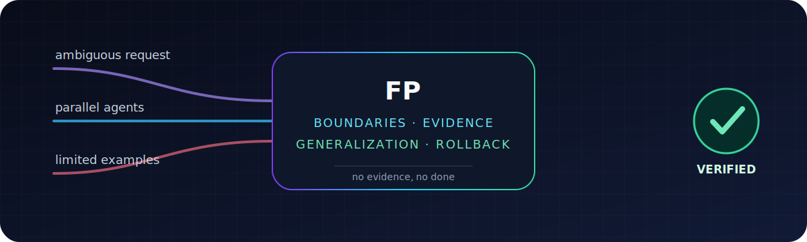

<p align="center">
  
</p>

# FP

**パッチはゴールではない。証明こそがゴールだ。**

[](https://github.com/MiaoY0uShan/FP/actions/workflows/validate.yml)
[](https://github.com/MiaoY0uShan/FP/releases)
[](LICENSE)

ほとんどのコーディングエージェントは、プロンプトからパッチへと急ぐ。FPはあなたのエージェントに、真のタスクを見つけさせ、すべての委譲に境界を設け、親エージェントが独立して検証できる証拠をもって完了させる。

FPは過去の実行から学ぶこともできる。ただし、一度の幸運な事例を普遍の法則に変えることによってではない。

FPは目標から有効化を推論する。エンジニアリング作業では自動的に読み込まれ、雑談や他の非エンジニアリング目標では休止状態を保つ。`FP:`と`$fp`は明示的な呼び出しとして任意で使用できる。

デーモン不要。データベース不要。必須のMCPサーバー不要。インストールしてエージェントをリロードすれば、普段通りに作業できる。

---

## 見覚えのある光景

4つのエージェントが同じファイルに触れる。1つはサービスを再起動する。別の1つはビルド成功を報告する。誰も、まだ接続できない端末を再テストしない。

FPは作業に境界、所有者、そして観測可能なゴールラインを与える。

```text
FPなしの場合

設定を編集 -> サービス再起動 -> 緑のステータス -> 「完了」

FPありの場合

実クライアントを再現する
-> 期待状態 / 生成状態 / 実効状態を比較する
-> 最初に失敗した境界を見つける
-> 認可された最小の変更を行う
-> 実クライアント + 陰性対照 + ライフサイクルを再実行する
-> 証拠を記録する
```

2番目の道は、推測より約5分遅い。その推測を2日間デバッグするよりは、はるかに速い。

## 動作の仕組み

```text
リクエスト
-> 実際のリスクに応じてルーティング
-> スコープ、権限、受け入れ基準を凍結
-> 境界付き作業を実行または委譲
-> 観測可能なチェックを実行
-> 証拠台帳を検証
-> オプションで再利用可能な学習候補を評価
```

小さな作業は小さいまま。インシデントは磨き上げより前にサービスを復旧する。未知の原因はパッチより前に診断を起動する。マルチデバイス監査は、いかなる対象も変更する前にベースライン証拠を収集する。現在の外部事実は、バージョン、ソース、鮮度の根拠、信頼境界を伴う。

コードを追加する前に、FPは短い再利用ラダーも辿る：

```text
1. これは存在する必要があるか？           不要 -> スキップ（YAGNI）
2. すでにコードベースに存在するか？       はい -> 再利用
3. 標準ライブラリが提供するか？            はい -> 使用
4. ネイティブプラットフォームの機能か？    はい -> 使用
5. インストール済みの依存関係か？          はい -> 使用
6. 明快な1行で十分か？                    はい -> 1行書く
7. ここでようやく                          -> 動作する最小限の新規コードを追加
```

セキュリティ、ロールバック、アクセシビリティ、データ整合性、必須証拠は、削除すべき「複雑さ」ではない。

## 分散的であり、混沌ではない

```text
親 / 統合者
|-- 境界付き調査 A              読み取り専用
|-- 境界付き調査 B              読み取り専用
|-- 候補学習者                   読み取り専用、提案のみ
|-- ブラインド評価者              隠しホールドアウト + オラクル
|-- 仕様レビュアー                独立したタスク + セッション
+-- 統合レビュアー                独立したタスク + セッション
             -> 境界付き証拠 + 評決

1人の作成者 -> 親が重要なチェックを再実行 -> 正規台帳
```

すべての論理子タスクは、タスクローカルエンベロープを受け取る：タスク/セッション/親ID、目標、コンテキスト参照、役割、ツール、ルートおよび直接親の権限上限、依存関係、ファイル/リソース、反復/試行/時間/深度の制限、冪等キー、出力予算、親専用アーティファクトパス、停止条件。

機械契約は信頼するのではなく導出する：

- 親および依存関係DAGの有効性と依存関係タイミングの成功
- 安定した入力順序の結果、観測された並行性、試行回数、タイムアウト、祖先キャンセル
- ルート/直接親の権限、リポジトリスコープ、URLスコープの交差
- 一意の作成者の所有権と、保持者/パス/期限付きリース解放証拠
- 実際の単語/バイトサマリーサイズと予約済み親所有アーティファクトルート
- 実行、プロデューサー、ゲート、対象タスクに紐付いた、独立した仕様、品質、キャンセル、冪等性、リース、コンテキスト分離、統合コマンド

リーフは委譲、認証情報の使用、デプロイ、外部メッセージ送信、メモリの昇格、またはライブ状態の変更を行うことができない。「リース解放済み」という真偽値は、実際に解放された証拠にはならない。

並列性は独立した作業のためのものだ。同じ共有ツリーを編集する2つのエージェントは、分散システムではない。楽観主義を伴うマージコンフリクトである。

## 偶然を暗記せずに学ぶ

FPは外部ポリシーを進化させる：スキル、スキーマ、チェックリスト、限定された自動化。モデル重みの訓練や統計的汎化の保証は主張しない。

```text
1回の証拠付き実行
-> 観測

1つの重大なケース
-> 最大でも、狭い有効期限付きシャドウチェックリスト

2〜4の独立した陽性事例
-> 1つを除外 -> ブラインド評価 -> 全ケースをローテーション

すべてのフォールド + 対照 + 不変条件 + 将来シャドウ + ロールバックが通過
-> 親承認済みのアクティブ候補
```

言い換え、ノイズバリアント、1セッションの5つのサブエージェントは有用な頑健性チェックである。それでも1つの独立した経験として数えられる。

アクティブ候補に必要なもの：

- 異なるタスク、セッション、入力、タスクファミリーの識別子を持つ再計算可能なソース台帳スナップショットハッシュ
- サンプルが小さい場合、各陽性事例を1回ホールドアウトし、ホールドアウトコンテキストを候補から隠蔽
- 同じブラインド評価者によるベースライン、候補、独立オラクルの証拠
- 回帰がなく、少なくとも1つの改善を示す同一単位の測定
- ルールがトリガーされてはいけない近傍事例
- 権限、スコープ、安全性、キャンセル、冪等性に関するゼロトレランスの不変条件
- 複雑性予算と、凍結された候補ハッシュにバイトが一致する適用対象
- 真に後続の3つのシャドウ観測、それぞれが新規で信頼できる台帳クロックにより制限
- 明示的な昇格権限、現在の来歴、テスト済みロールバック

訓練の失敗は未学習を露呈する。ホールドアウトの回帰は過学習を露呈する。陰性対照の失敗は過度に広いトリガーを露呈する。いずれも平均化で帳消しにできない。

[汎化ゲート](fp/generalization-gate/SKILL.md)とその[機械契約](fp/contracts/evidence-ledger.v1.schema.json)を参照。

## 「ノー」と言える証拠

`fp/contracts/evidence-ledger.v1.schema.json`とゼロ依存の意味論的バリデーターが真実の源泉を構成する。

これらは主張を観測されたコマンドに結びつけ、独立したリポジトリ/ネットワーク/書き込みスコープを強制し、最終実行をそのブリーフと比較し、ライブシステムと外部コンテキストの証拠を検証し、無関係なチェック、捏造されたメトリクス、未来日付の学習、または陳腐化した継続状態に対してフェイルクローズドで応答する。

```text
スコープ -> 受け入れ行 -> 境界付き実行 -> 観測可能なチェック -> 検証済みの主張
```

緑のプロセス、サービス再起動、子サマリー、実装diffは、それ自体では完了証拠にならない。宣言された証拠が通過すると、FPは1つの評決を発行し、不変状態に対する決定中立的なチェックを追加する代わりに停止する。

## インストール

1つのアーカイブ。1つのインストーラー。1回の読み取り専用検証。

1. [Releases](https://github.com/MiaoY0uShan/FP/releases)から最新の`fp-universal-v{version}.zip`をダウンロードする。
2. プロジェクトルートに展開する。
3. Windowsでは`INSTALL-FP.cmd`を実行する。macOS/Linuxでは`sh ./INSTALL-FP.sh`を実行する。
4. Windowsでは`INSTALL-FP.cmd -Verify`、macOS/Linuxでは`sh ./INSTALL-FP.sh --verify`で検証し、AIツールをリロードして普段通りに作業する。

インストーラーは書き込み前に、所有権、衝突、リンク/再解析ポイント、管理対象ブロック、バックアップをチェックする。検証済みアンインストールは、インストーラー所有のコンテンツのみを削除する。

[正確なコマンドと互換性ティア](INSTALL.md) | [ZeroToHeroまたはXskillからの移行](MIGRATION.md) | [コピーペースト代替案](fp-copy-paste.md)

Claude Codeパックには、スキル検出用の`.claude/skills/fp/`とシステムレベル自動注入用の`.claude/CLAUDE.md`が含まれている——Superpowersと同じメカニズムである。他のホストは、ユニバーサルインストーラーを介してツール固有のエントリポイントを取得する。

エンジニアリング目標はキーワードなしでFPを有効化する。以下の明示的な形式は任意のままである：

```text
FP: パスワードリセットの回帰を診断して修正せよ。
$fp このリポジトリのリリースワークフローを編集せずにレビューせよ。
```

## 数字——本物である場合に

**ベースラインなしは改善の主張なしを意味する。**

FPは証拠付き実行から、検証率、スコープクリープ、手戻り、コンテキスト負荷プロキシ、検証済み進捗あたりのトークン数を計算できる。欠損値は`unknown`のままである。公正な比較は、タスク、モデル、リポジトリリビジョン、権限、受け入れチェックを固定する。

ここに装飾的な「42%改善」グラフはない。バリデーターはベースラインがどこに行ったかを問うだろう。

[メトリクス契約](docs/metrics.md) | [ケーススタディ](docs/case-studies.md) | [フォワードテスト記録](docs/forward-tests-2026-07-14.md)

## ルート

FPは圧縮された4ルートモデルを使用する：

| ルート | いつ | 何が起こるか |
| --- | --- | --- |
| **緊急 / 高リスク** | インシデント、厳しい追及、プロトコル変更 | 意図を確認 → 権限内で行動。インシデントは修復より前に復旧する。 |
| **読み取り専用診断** | 未知の障害またはプロアクティブスキャン | デバッグ優先：仮説 → 調査 → 認可された修正。監査：ターゲットごとのベースライン → P0/P1/P2レポート。 |
| **ビルド** | 明確または曖昧な実装 | 小 → ミニブリーフ。中 → 実行ブリーフ + 台帳。曖昧 → アイデアカード。大 → 最小モジュール → 最終ブリーフ。 |
| **クローズ** | すべてのタスク | 一致する証拠でパス → 1つの評決 → 停止。追加の診断は決定を変えるか受け入れ行を埋めなければならない。状態変更は依然として必須の回帰と陰性対照をトリガーする。 |

小さな明確な編集 → 5行のブリーフと1つの関連チェック。アクティブな障害 → `観測 → 封じ込め → 復旧 → 修復 → 学習`。マルチデバイスフリートスキャン → ターゲットごとの読み取り専用証拠、クロスターゲット比較、その後ターゲットごとの認可された修復。

ライブシステム、外部コンテキスト、プロバイダー互換性/利用料制御、マルチエージェントと委譲実行、継続、自己反復、バックグラウンド学習が、これらのルートにレイヤーとして重なる。

委譲実行は明示的になった：各作業項目は、親が統合チェックを再実行する前に、フレッシュな実装者、フレッシュなタスクレビュアー、条件付きのフレッシュな修正者とフレッシュな再レビュアー、そしてフレッシュな最終統合レビュアーを得る。独立した問題ドメインは、共有状態、ファイル、生成出力、依存関係が分離していることが証明された後にのみ展開される。FPはモデル名から推測するのではなく、インストールされたホストの観測されたネイティブランタイム（Codex `spawn_agent`、Claude Code `Agent`、Kimi Code `Agent`/`AgentSwarm`、Qwen Code `agent`など）を選択する。ホストUIが表示する人間の名前は表面的なものであり、FPは決定論的なタスクIDを使用する。

サードパーティプロバイダーとローカルゲートウェイ向けに、プロバイダー互換性プロファイルは実効ホスト -> プロキシ -> ワイヤーモデル -> プロバイダーチェーンを解決し、プロキシ健全性を確認し、ネストされたリトライ上限を乗算し、リクエスト/トークン/サブエージェント予算を凍結し、繰り返される意味論的アクションを停止し、プロバイダーネイティブの使用量を調整する。これは無制限の支出を防ぎ、壊れた境界を特定できるが、プロバイダーが実装していないプロトコル機能を追加することはできない。

インストール済みのMCPが受け入れ行に真に必要な場合、FPはタスクの既存の権限内でそれを自動的に使用する。存在しない場合、FPはまず正確なソース、バージョン、インストール範囲、権限/データ露出、認証ニーズ、検証、ロールバックを提示する。ユーザーが明示的にその概要を承認するまで、何もダウンロードまたはインストールされない。

## 開発

正規ソースは`fp/`に存在する。生成されたホストパックは`install/`に18エージェント（Claude Code、Codex、Gemini CLI、Cursor、Windsurf、Cline、Roo Code、OpenCode、Kiro、Qoder、Aider、GitHub Copilot CLI、GitHub Copilot Editor、他）向けに存在する。すべての生成コピーはスクリプトによって更新され、手動で編集されることは決してない。

```text
node scripts/lint-fp.js
node scripts/lint-release.js
node scripts/lint-contracts.js --ledger fp/examples/password-reset.evidence-ledger.json --brief fp/examples/password-reset.compiled-execution-brief.json
node --test
powershell -NoProfile -File scripts/sync-install-packs.ps1 -Check
```

リリースワークフローは、Windows PowerShellのライフサイクル、POSIXインストール/検証/アンインストール、パッケージチェックサム、アーカイブエントリポイント、クリーンな生成パックdiffもゲートする。

## FAQ

### すべてのタスクが儀式化されるのか？

いいえ。1行の修正に憲法は必要ない。

### サブエージェントがタスク全体の完了を宣言できるか？

証拠と評決を返すことはできる。親は依然として重要なチェックを再実行し、最終的な主張を所有する。

### 一部のツールがエージェントに外国の人間名を表示するのはなぜか？

それはホストUIのラベリングであり、FPの要件ではない。FPは`T03-implementer`や`T03-reviewer`のような意味的IDを記録する。ランタイムは、同一性、所有権、新しさ、証拠を変更することなく、任意のニックネームを表示できる。

### DeepSeek、Kimi、Qwen API自体はサブエージェントを提供するのか？

しない。それらはモデルプロバイダーである。Kimi CodeとQwen Codeは独自のサブエージェントツールを持つエージェントホストである。Claude Codeの背後で使用されるモデルAPIは、依然としてClaude Codeのランタイムを使用する。公式ソースレジストリはホストとモデル専用APIを区別し、インストール済み機能が欠如している場合はフェイルクローズドで応答する。

### 1回の成功した実行から学習するのか？

1つの観測を記録する。1つの逸話はスキーマではない。

### これは自律的な自己改変AIか？

違う。バックグラウンドエージェントは凍結された候補を提案できる。独立した評価者がそれらをテストする。昇格には宣言された権限、機械的証拠、将来シャドウウィンドウ、ロールバックが必要である。

### Hermes、Context7、または他の実行中サービスが必要か？

不要。それらの有用なプロトコルアイデアは、ポータブルなローカル契約に適応された。それらのデーモン、データベース、MCPサービス、プライベートバックエンド、クローラーは依存関係ではない。

### FPは不足しているMCPを自動的にインストールするか？

明示的な承認後にのみ。FPはすでに利用可能なタスク必須MCPを自動的に呼び出すが、不足しているMCPは最初に境界付き取得概要を受け取る。インストールの承認は、ログイン、シークレット、設定変更、再起動、常駐サービス、またはより広範なタスクアクションを黙示的に許可しない。

### より少ないトークンやより速いデリバリーを約束するか？

制御された反復比較によって証明された後にのみ。

## 影響

FPはオリジナルの実装である。その設計は[Superpowers](https://github.com/obra/superpowers)、[Hermes Agent](https://github.com/NousResearch/hermes-agent)、[Ponytail](https://github.com/DietrichGebert/ponytail)、[Context7](https://github.com/upstash/context7)、[Grill Me](https://github.com/mattpocock/skills/tree/main/skills/productivity/grill-me)、[code-review-graph](https://github.com/tirth8205/code-review-graph)の研究によって研ぎ澄まされた。

正確なリビジョン、採用された動作、除外事項、推論境界は[docs/upstream-influences.md](docs/upstream-influences.md)にある。ライセンス来歴は[THIRD_PARTY_NOTICES.md](THIRD_PARTY_NOTICES.md)にある。

旧称Xskill。[MIGRATION.md](MIGRATION.md)を参照。

---

**言語版：** [English](README.md) · [中文](README.zh-CN.md) · [हिन्दी](README.hi.md) · [Español](README.es.md) · [Français](README.fr.md) · [العربية](README.ar.md) · [Português](README.pt.md) · [Русский](README.ru.md) · [日本語](README.ja.md)

## ライセンス

MIT。使用し、検証し、改善し、表示を保持すること。
