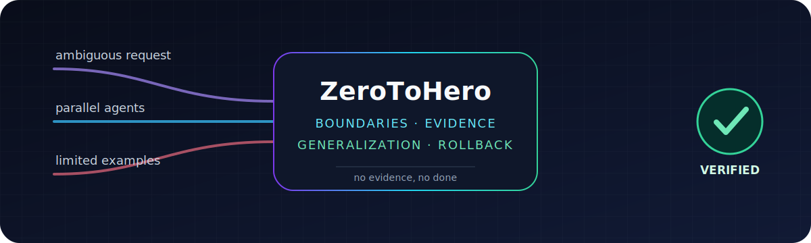

<p align="center">
  
</p>

# ZeroToHero

**The patch is not the finish line. Proof is.**

[](https://github.com/MiaoY0uShan/ZeroToHero/actions/workflows/validate.yml)
[](https://github.com/MiaoY0uShan/ZeroToHero/releases)
[](LICENSE)

Most coding agents rush from prompt to patch. ZeroToHero makes yours find the real task, bound every delegation, and finish with evidence a parent agent can independently verify.

It can learn from prior runs too. Just not by turning one lucky anecdote into permanent law.

No daemon. No database. No required MCP server. Install it, reload your agent, and work normally.

---

## You know this run

Four agents touch the same files. One restarts the service. Another reports a green build. Nobody reruns the phone that still cannot connect.

ZeroToHero gives the work a boundary, an owner, and a finish line that can be observed.

```text
Without

edit config -> restart service -> green status -> "done"

With ZeroToHero

reproduce the real client
-> compare desired / generated / effective state
-> find the first failing boundary
-> make the smallest authorized change
-> rerun the real client + negative control + lifecycle
-> record evidence
```

The second path is slower than guessing for about five minutes. It is considerably faster than debugging the guess for two days.

## How it works

```text
request
-> route the actual risk
-> freeze scope, authority, and acceptance
-> execute or delegate bounded work
-> run observed checks
-> validate the Evidence Ledger
-> optionally evaluate a reusable learning candidate
```

Small work stays small. Incidents restore service before polishing. Unknown causes trigger diagnosis before patches. Current external facts carry a version, source, freshness basis, and trust boundary.

Before adding code, ZeroToHero also walks a short reuse ladder:

```text
1. Does this need to exist?      no -> skip it (YAGNI)
2. Already in the codebase?     yes -> reuse it
3. Standard library does it?    yes -> use it
4. Native platform feature?     yes -> use it
5. Installed dependency?        yes -> use it
6. One clear line is enough?    yes -> write one line
7. Only then                    -> add the minimum new code that works
```

Security, rollback, accessibility, data integrity, and required evidence are not "complexity" to delete.

## Distributed, not chaotic

```text
parent / integrator
|-- bounded investigation A       read-only
|-- bounded investigation B       read-only
|-- candidate learner             read-only, proposal only
|-- blind evaluator               hidden holdout + oracle
|-- spec reviewer                 independent task + session
+-- integration reviewer          independent task + session
             -> bound evidence + verdicts

one writer -> parent reruns critical checks -> canonical ledger
```

Every logical child task receives a task-local envelope: task/session/parent IDs, goal, context references, role, tools, root and direct-parent authority ceilings, dependencies, files/resources, iteration/attempt/time/depth limits, idempotency key, output budget, parent-only artifact path, and stop condition.

The machine contract derives rather than trusts:

- parent and dependency DAG validity and successful dependency timing;
- stable input-order results, observed concurrency, attempts, timeout, and ancestor cancellation;
- root/direct-parent authority, repository scope, and URL-scope intersections;
- unique writer ownership plus holder/path/time-bound lease release evidence;
- actual word/byte summary size and a reserved parent-owned artifact root;
- separate spec, quality, cancellation, idempotency, lease, context-isolation, and integration commands bound to the run, producer, gate, and covered tasks.

Leaves cannot delegate, use credentials, deploy, message externally, promote memory, or mutate live state. A boolean saying "leases released" is not proof that they were.

Parallelism is for independent work. Two agents editing the same shared tree are not a distributed system. They are a merge conflict with optimism.

## Learn without memorizing the accident

ZeroToHero evolves external policy: skills, schemas, checklists, and bounded automation. It does not claim to train model weights or guarantee statistical generalization.

```text
one evidenced run
-> observation

one severe case
-> narrow expiring shadow checklist, at most

2-4 independent positive cases
-> leave one out -> blind evaluation -> rotate every case

all folds + controls + invariants + future shadow + rollback pass
-> parent-approved active candidate
```

Paraphrases, noise variants, and five subagents from one session are useful robustness checks. They still count as one independent experience.

An active candidate needs:

- recomputable source-ledger snapshot hashes with distinct task, session, input, and task-family identities;
- every positive case held out once when the sample is small, with holdout context withheld from the candidate;
- baseline, candidate, and independent-oracle evidence from the same blind evaluator;
- same-unit measurements that derive no regression and at least one improvement;
- a near-neighbor case where the rule must not trigger;
- zero-tolerance authority, scope, safety, cancellation, and idempotency invariants;
- a complexity budget and an applied target whose bytes match the frozen candidate hash;
- three genuinely later shadow observations, each new and bounded by a trusted ledger clock;
- explicit promotion authority, current provenance, and tested rollback.

Training failures expose underfitting. Holdout regressions expose overfitting. Negative-control failures expose an over-broad trigger. None can be averaged away.

See [the Generalization Gate](zerotohero/generalization-gate/SKILL.md) and its [machine contract](zerotohero/contracts/evidence-ledger.v1.schema.json).

## Evidence that can say "no"

`zerotohero/contracts/evidence-ledger.v1.schema.json` plus the zero-dependency semantic validator form the source of truth.

They bind claims to observed commands, enforce separate repository/network/write scopes, compare the final run with its brief, validate live-system and external-context evidence, and fail closed on unrelated checks, fabricated metrics, future-dated learning, or stale continuation state.

```text
scope -> acceptance rows -> bounded execution -> observed checks -> verified claims
```

A green process, service restart, child summary, or implementation diff is not completion evidence by itself.

## Install

One archive. One installer. One read-only verification.

1. Download the latest `zerotohero-universal-v{version}.zip` from [Releases](https://github.com/MiaoY0uShan/ZeroToHero/releases).
2. Extract it into the project root.
3. On Windows, run `INSTALL-ZEROTOHERO.cmd`. On macOS/Linux, run `sh ./INSTALL-ZEROTOHERO.sh`.
4. Verify with `INSTALL-ZEROTOHERO.cmd -Verify` on Windows or `sh ./INSTALL-ZEROTOHERO.sh --verify` on macOS/Linux, then reload the AI tool and work normally.

The installer checks ownership, collisions, links/reparse points, managed blocks, and backups before writing. Verified uninstall removes only installer-owned content.

[Exact commands and compatibility tiers](INSTALL.md) | [Migration from Xskill](MIGRATION.md) | [Copy-paste fallback](zerotohero-copy-paste.md)

Manual activation remains optional:

```text
ZeroToHero: Diagnose and fix the password-reset regression.
```

## Numbers, when they are real

**No baseline means no improvement claim.**

ZeroToHero can calculate verification rate, scope creep, rework, context-load proxy, and Tokens to Verified Progress from an evidenced run. Missing values remain `unknown`. A fair comparison fixes the task, model, repository revision, authority, and acceptance checks.

There is no decorative "42% better" chart here. The validator would ask where the baseline went.

[Metrics contract](docs/metrics.md) | [Case studies](docs/case-studies.md) | [Forward-test record](docs/forward-tests-2026-07-14.md)

## Routes

| Situation | ZeroToHero response |
| --- | --- |
| Tiny clear edit | Five-line brief and one relevant check |
| Unknown cause / diagnose-only | Read-only causal probes before any fix |
| Active outage or data-loss risk | `OBSERVE -> CONTAIN -> RESTORE -> REPAIR -> LEARN` |
| Medium implementation | Execution Brief, acceptance matrix, Evidence Ledger |
| Vague or coupled work | Requirements/architecture only until one executable brief exists |
| Failed attempt | Preserve evidence, change the experiment, split the slice |

Live systems, external context, multi-agent work, continuation, self-iteration, and background learning layer onto these routes. They do not make every typo write a constitution.

## Develop

Canonical source lives in `zerotohero/`. Generated host packs live in `install/` and are refreshed by script, never hand-edited.

```text
node scripts/lint-zerotohero.js
node scripts/lint-release.js
node scripts/lint-contracts.js --ledger zerotohero/examples/password-reset.evidence-ledger.json --brief zerotohero/examples/password-reset.compiled-execution-brief.json
node --test
powershell -NoProfile -File scripts/sync-install-packs.ps1 -Check
```

The release workflow also gates the Windows PowerShell lifecycle, POSIX install/verify/uninstall, package checksums, archive entrypoints, and a clean generated-pack diff.

## FAQ

### Does every task become a ceremony?

No. A one-line fix should not need a constitution.

### Can a subagent declare the whole task complete?

It can return evidence and a verdict. The parent still reruns critical checks and owns the final claim.

### Does it learn from one successful run?

It records one observation. One anecdote is not a schema.

### Is this autonomous self-modifying AI?

No. Background agents can propose frozen candidates. Independent evaluators test them. Promotion requires declared authority, machine evidence, a future shadow window, and rollback.

### Does it need Hermes, Context7, or another service running?

No. Their useful protocol ideas were adapted into a portable local contract. Their daemons, databases, MCP services, private backends, and crawlers are not dependencies.

### Does it promise fewer tokens or faster delivery?

Only after a controlled repeated comparison proves it.

## Influences

ZeroToHero remains an original implementation. Its design was sharpened by studying [Superpowers](https://github.com/obra/superpowers), [Hermes Agent](https://github.com/NousResearch/hermes-agent), [Ponytail](https://github.com/DietrichGebert/ponytail), [Context7](https://github.com/upstash/context7), and [Grill Me](https://github.com/mattpocock/skills/tree/main/skills/productivity/grill-me).

The exact revisions, adopted behaviors, exclusions, and inference boundaries are in [docs/upstream-influences.md](docs/upstream-influences.md). License provenance is in [THIRD_PARTY_NOTICES.md](THIRD_PARTY_NOTICES.md).

Formerly Xskill. See [MIGRATION.md](MIGRATION.md).

## License

MIT. Use it, inspect it, improve it, and keep the notice.
