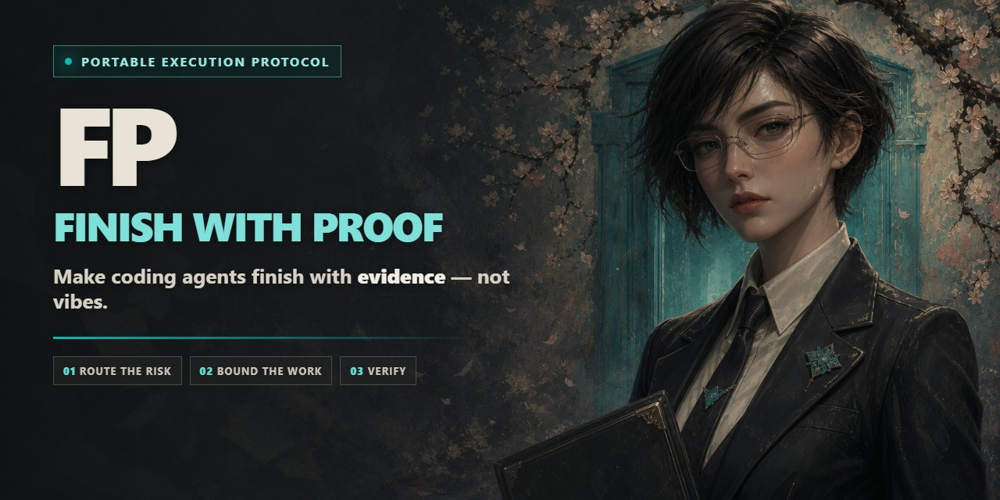
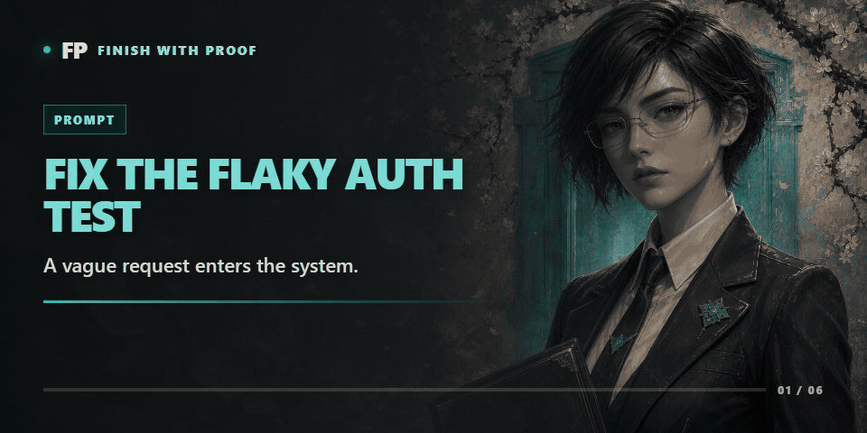

<p align="center">
  
</p>

<h1 align="center">FP — Finish with Proof</h1>

<p align="center"><strong>Make coding agents finish with proof — not vibes.</strong></p>

<p align="center">
  A portable execution protocol for Codex, Claude Code, Gemini CLI, Pi, Cursor, Copilot, and other coding agents.
</p>

<p align="center">
  <a href="https://github.com/MiaoY0uShan/FP/stargazers"></a>
  <a href="https://github.com/MiaoY0uShan/FP/actions/workflows/validate.yml"></a>
  <a href="https://github.com/MiaoY0uShan/FP/releases"></a>
  <a href="LICENSE"></a>
</p>

<p align="center">
  <a href="https://github.com/MiaoY0uShan/FP/releases/latest"><strong>Download</strong></a> ·
  <a href="#30-second-tour">30-second tour</a> ·
  <a href="INSTALL.md">Install guide</a> ·
  <a href="README.zh-CN.md">中文</a>
</p>

> **The shareable version:** FP gives coding agents a risk-matched workflow: diagnose before patching, keep delegation bounded, rerun real checks, and refuse to call work done without evidence.

FP activates automatically for engineering work and stays dormant for casual conversation. Small fixes stay small. Incidents restore service before refactoring. Unknown causes trigger diagnosis before edits.

**No daemon. No database. No vendor lock-in.** Install the instructions, reload your agent, and work normally.

---

## Why FP

| Without FP | With FP |
|---|---|
| Prompt → patch → “looks fixed” | Route risk → bound scope → verify → verdict |
| Guess at the cause and edit immediately | Find the first supported divergence before patching |
| Spawn agents and trust their summaries | One writer, bounded tasks, fresh review, parent verification |
| Run one happy-path test | Rerun the symptom, regression checks, and a negative control |
| Install tools or MCPs when convenient | Show source, scope, permissions, rollback, then ask |
| Turn one lucky result into a permanent rule | Promote patterns only after independent evidence |

The rule people remember:

> **No proof, no done.**

## 30-second tour

You ask an agent:

```text
Fix the intermittent authentication test.
```

A typical agent may increase a timeout, run the test once, and say “fixed.”

FP changes the workflow:

<p align="center">
  
</p>

```text
1. Reproduce the original failure.
2. Find the first point where expected and actual behavior diverge.
3. Make the smallest change that addresses that cause.
4. Rerun the original failure.
5. Run adjacent regression checks.
6. Run a negative control to guard against over-fixing.
7. Report one verdict with observed evidence.
```

For a small task, FP may produce only a few lines. For a risky change, it freezes scope, authority, rollback, and acceptance evidence before execution.

## What you get

| Capability | What it prevents |
|---|---|
| **Risk-matched routing** | Turning every one-line fix into ceremony — or treating an incident like a one-line fix |
| **Debug before patch** | Speculative edits that hide the real cause |
| **Reuse before creation** | Agent-generated abstractions, dependencies, and files that did not need to exist |
| **Bounded delegation** | Runaway subagents, overlapping writers, and “the child said it passed” |
| **Evidence Ledger** | Completion claims that cannot be independently checked |
| **Provider/spend guards** | Retry multiplication, semantic loops, silent model remapping, and misleading usage totals |
| **MCP acquisition gate** | Surprise installs, credentials, background services, or permissions |
| **Evidence-gated learning** | Overfitting one task and silently rewriting future behavior |

## Works where you work

FP ships dedicated release packs or portable instruction adapters for:

**Codex · Claude Code · Gemini CLI · Pi · GitHub Copilot CLI · Cursor · Windsurf · Cline · Roo Code · OpenCode · Kiro · Aider · GitHub Copilot Editor · and more**

All adapters delegate to one canonical router. You do not maintain a different methodology for every agent.

## Install in about a minute

1. Open the [latest release](https://github.com/MiaoY0uShan/FP/releases/latest).
2. Download the asset whose name starts with `fp-universal-v`.
3. Extract it into your project root.
4. Run the installer and its read-only verification.

### Windows

```powershell
.\INSTALL-FP.cmd
.\INSTALL-FP.cmd -Verify
```

### macOS / Linux

```sh
sh ./INSTALL-FP.sh
sh ./INSTALL-FP.sh --verify
```

Reload your agent. No special command is required: FP activates automatically when the goal is engineering work.

Optional explicit invocations still work:

```text
FP: Fix the password reset bug and prove it with the original failing check.
$fp Diagnose the flaky test without editing until the cause is supported.
```

[Full install matrix](INSTALL.md) · [Migration from ZeroToHero or Xskill](MIGRATION.md) · [Copy-paste fallback](fp-copy-paste.md)

## The protocol

FP compresses work into four routes and layers specialist profiles only when needed:

| Route | Use it for | Behavior |
|---|---|---|
| **Urgent / High-Stakes** | Incidents, security events, protocol changes | Confirm boundaries, preserve access, restore before repairing |
| **Read-Only Diagnosis** | Unknown failures and proactive audits | Hypothesis → discriminating probe → supported cause → authorized fix |
| **Build** | Clear, vague, medium, or large implementation | Scale planning weight to risk; delete scope before adding code |
| **Close** | Every task | Match evidence to acceptance, emit one verdict, stop |

Profiles cover live systems, multi-agent work, provider compatibility, external context, continuation, memory graphs, codebase analysis, and background learning.

### The reuse ladder

Before creating code, FP asks:

```text
Does this need to exist?
→ already in the codebase?
→ standard library?
→ native platform feature?
→ installed dependency?
→ one clear line?
→ only then add the minimum new code
```

## Distributed, not chaotic

The parent agent owns integration and the final claim. Delegated work gets a frozen envelope: goal, scope, allowed resources, forbidden actions, budget, and required evidence.

```text
fresh implementer
→ fresh reviewer
→ bounded fixer when needed
→ re-review
→ final integration review
→ parent reruns critical checks
```

Parallelism is for work that is actually independent. Shared files keep one active writer.

## Context and graphs without lock-in

FP can use code-review-graph MCP for blast-radius analysis, affected flows, architecture, and test gaps. When the MCP is unavailable, the protocol falls back to local repository search and explicit impact maps.

FP's own reusable knowledge uses plain Markdown, YAML frontmatter, `[[wikilink]]` edges, and zero-dependency Node.js scripts. No database is required.

## Learn without memorizing the accident

One successful run is an observation, not a law.

```text
observation
→ bounded candidate
→ independent cases
→ negative control
→ shadow use
→ authorized promotion
→ rollback if it transfers badly
```

This keeps useful learning while resisting overfitting, self-confirmation, and silent rule drift.

## Trust model

- FP does not expand filesystem, credential, deployment, messaging, or live-system authority.
- Missing tools are not installed without explicit approval.
- Another agent's summary is not completion evidence.
- A healthy process, HTTP 200, or passing happy path is not automatically proof of function.
- Secrets must be redacted from logs, handoffs, examples, and final answers.
- Release assets are checksummed and validated through install, verify, and uninstall lifecycles.

## FAQ

### Does every task become a ceremony?

No. FP deliberately keeps small work small and adds process only when risk or ambiguity requires it.

### Is FP another coding agent?

No. FP is a portable execution protocol installed into the agent you already use.

### Does FP require a specific model or provider?

No. It is model- and host-agnostic. Provider-specific behavior is handled through compatibility and spend guards.

### Can a subagent declare the whole task complete?

No. The parent owns integration and reruns critical checks before claiming completion.

### Does FP automatically install missing MCP servers?

No. It uses an already available task-required MCP automatically, but a missing dependency gets an acquisition brief and requires approval.

### Is this autonomous self-modifying AI?

No. Reusable changes require independent evidence, bounded evaluation, declared promotion authority, shadow observations, and rollback.

## If this resonates

If you have ever watched an agent confidently say “done” before proving anything:

1. **Star the repository** so you can find it again.
2. Share this line with your team: **“No proof, no done.”**
3. Open an issue describing the failure mode FP should handle next.

Suggested share text:

> FP is a portable protocol for coding agents: diagnose before patching, bound subagents, verify real outcomes, and finish with proof — not vibes.

## Develop

Canonical source lives in `fp/`; generated host packs live in `install/`. Never hand-edit generated packs.

```text
node scripts/lint-fp.js
node scripts/lint-release.js
node scripts/lint-contracts.js --ledger fp/examples/password-reset.evidence-ledger.json --brief fp/examples/password-reset.compiled-execution-brief.json
node --test
powershell -NoProfile -File scripts/sync-install-packs.ps1 -Check
```

## Influences

FP is an original implementation sharpened by studying [Superpowers](https://github.com/obra/superpowers), [Hermes Agent](https://github.com/NousResearch/hermes-agent), [Ponytail](https://github.com/DietrichGebert/ponytail), [Context7](https://github.com/upstash/context7), [Grill Me](https://github.com/mattpocock/skills/tree/main/skills/productivity/grill-me), and [code-review-graph](https://github.com/tirth8205/code-review-graph).

Exact revisions, adopted behaviors, and exclusions are documented in [upstream influences](docs/upstream-influences.md). License provenance is in [THIRD_PARTY_NOTICES.md](THIRD_PARTY_NOTICES.md).

Formerly Xskill. See [MIGRATION.md](MIGRATION.md).

---

**Languages:** [English](README.md) · [中文](README.zh-CN.md) · [हिन्दी](README.hi.md) · [Español](README.es.md) · [Français](README.fr.md) · [العربية](README.ar.md) · [Português](README.pt.md) · [Русский](README.ru.md) · [日本語](README.ja.md)

## License

MIT. Use it, inspect it, improve it, and keep the notice.
