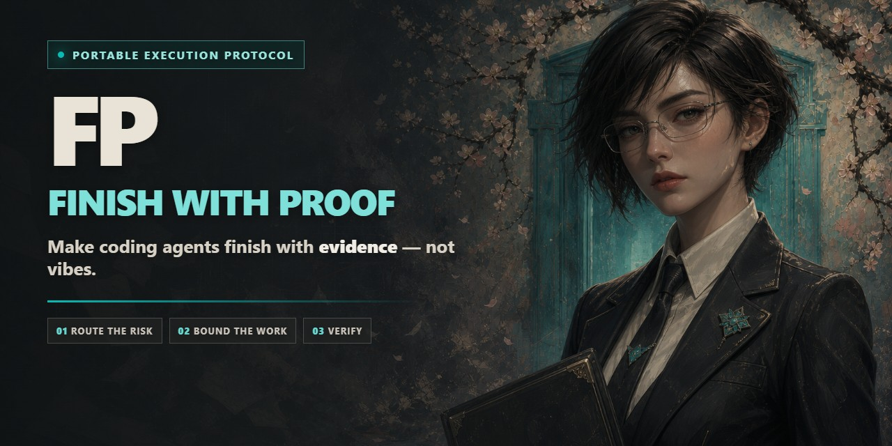
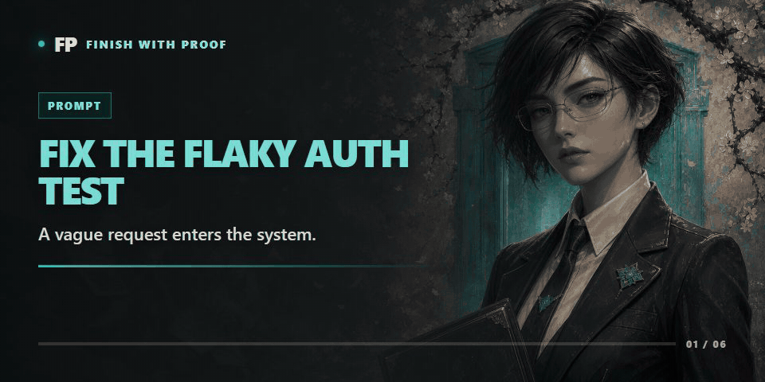

<p align="center">
  
</p>

<h1 align="center">FP — Finish with Proof</h1>

<p align="center"><strong>让编码 agent 用证据收尾，而不是凭感觉宣布完成。</strong></p>

<p align="center">
  一套可移植的执行协议，适用于 Codex、Claude Code、Gemini CLI、Pi、Cursor、Copilot 和其他编码 agent。
</p>

<p align="center">
  <a href="https://github.com/MiaoY0uShan/FP/stargazers"></a>
  <a href="https://github.com/MiaoY0uShan/FP/actions/workflows/validate.yml"></a>
  <a href="https://github.com/MiaoY0uShan/FP/releases"></a>
  <a href="LICENSE"></a>
</p>

<p align="center">
  <a href="https://github.com/MiaoY0uShan/FP/releases/latest"><strong>下载</strong></a> ·
  <a href="#30-秒导览">30 秒导览</a> ·
  <a href="INSTALL.md">安装指南</a> ·
  <a href="README.md">English</a>
</p>

> **适合分享的一句话版本：** FP 为编码 agent 提供与风险匹配的工作流：先诊断再打补丁，限制委托边界，重新运行真实检查，没有证据就不宣布完成。

FP 会在工程任务中自动激活，在闲聊时保持休眠。小修复保持轻量；线上事件先恢复服务再重构；原因未知时先诊断再编辑。

**无守护进程。无数据库。无供应商锁定。** 安装这些指令，重新加载 agent，然后照常工作。

---

## 为什么选择 FP

| 没有 FP | 使用 FP |
|---|---|
| 提示 → 补丁 → “看起来修好了” | 风险路由 → 限定范围 → 验证 → 裁决 |
| 猜测原因并立即编辑 | 打补丁前找到第一个有证据支持的分歧点 |
| 启动多个 agent，然后相信它们的摘要 | 单写者、有边界的任务、全新审查、父 agent 验证 |
| 只运行一条正常路径测试 | 重跑原始症状、回归检查和负向控制 |
| 觉得方便时就安装工具或 MCP | 先展示来源、范围、权限和回滚，再征求批准 |
| 把一次幸运结果变成永久规则 | 只有在独立证据支持后才提升模式 |

最容易记住的规则：

> **No proof, no done. 没有证据，就不算完成。**

## 30 秒导览

你向 agent 提出：

```text
修复间歇性失败的鉴权测试。
```

普通 agent 可能会增大超时时间，运行一次测试，然后说“修好了”。

FP 会改变工作流：

<p align="center">
  
</p>

```text
1. 复现原始失败。
2. 找到预期行为与实际行为最先出现分歧的位置。
3. 做出解决该原因的最小修改。
4. 重跑原始失败。
5. 运行相邻回归检查。
6. 运行负向控制，防止过度修复。
7. 用观测到的证据给出一个裁决。
```

对于小任务，FP 可能只输出几行。对于高风险改动，它会在执行前冻结范围、权限、回滚和验收证据。

## 你会得到什么

| 能力 | 它防止的问题 |
|---|---|
| **风险匹配路由** | 把每个一行修复都变成仪式，或把事故当成一行修复处理 |
| **先调试再打补丁** | 用猜测性编辑掩盖真正原因 |
| **先复用再创建** | agent 生成本不需要存在的抽象、依赖和文件 |
| **有边界的委托** | 失控的子 agent、重叠写入者，以及“子 agent 说通过了” |
| **证据账本** | 无法被独立检查的完成声明 |
| **Provider/成本保护** | 重试倍增、语义循环、静默模型映射和误导性的用量合计 |
| **MCP 获取门** | 意外安装、凭据、后台服务或额外权限 |
| **证据门控学习** | 对单个任务过拟合并静默改写未来行为 |

## 适配你的工作环境

FP 为以下工具提供专用发布包或可移植指令适配器：

**Codex · Claude Code · Gemini CLI · Pi · GitHub Copilot CLI · Cursor · Windsurf · Cline · Roo Code · OpenCode · Kiro · Aider · GitHub Copilot Editor · 以及更多工具**

所有适配器都委托给同一个 canonical router。你不需要为每个 agent 维护一套不同的方法论。

## 大约一分钟完成安装

1. 打开[最新 Release](https://github.com/MiaoY0uShan/FP/releases/latest)。
2. 下载名称以 `fp-universal-v` 开头的资产。
3. 将它解压到项目根目录。
4. 运行安装器及其只读验证。

### Windows

```powershell
.\INSTALL-FP.cmd
.\INSTALL-FP.cmd -Verify
```

### macOS / Linux

```sh
sh ./INSTALL-FP.sh
sh ./INSTALL-FP.sh --verify
```

重新加载 agent。无需特殊命令：当目标是工程工作时，FP 会自动激活。

可选的显式调用仍然有效：

```text
FP: 修复密码重置缺陷，并用原始失败检查证明它。
$fp 诊断不稳定测试，在原因得到证据支持前不要编辑。
```

[完整安装矩阵](INSTALL.md) · [从 ZeroToHero 或 Xskill 迁移](MIGRATION.md) · [复制粘贴备用版本](fp-copy-paste.md)

## 执行协议

FP 将工作压缩为四条路由，只在需要时叠加专用 profile：

| 路由 | 适用场景 | 行为 |
|---|---|---|
| **紧急 / 高风险** | 事故、安全事件、协议变更 | 确认边界，保留访问路径，先恢复再修复 |
| **只读诊断** | 未知故障和主动审计 | 假设 → 判别探针 → 有证据支持的原因 → 获得授权的修复 |
| **构建** | 清晰、模糊、中型或大型实现 | 按风险调整规划重量；加代码前先删除范围 |
| **收尾** | 每个任务 | 让证据匹配验收条件，给出一个裁决，然后停止 |

Profile 覆盖线上系统、多 agent、provider 兼容性、外部上下文、续接、记忆图、代码库分析和后台学习。

## 一眼扫过也不会丢失状态的回复

FP 使用一个阻塞式首尾行发送门：如果读者只看第一行和最后一行，也必须知道“刚刚发生了什么”和“下一步做什么”；否则重写。

- 第一行放答案/结果和下一个由 agent 承担的动作；背景往后放，无用铺垫直接删除。
- 每轮重述活跃的多步骤状态：`第 3 步，共 5 步，已完成：schema 已更新。下一步：运行回填脚本。`
- 报错不演戏：列出位置、现象、原因或 `unknown`、修法/探针和验证。绝不输出真实 Bearer token。
- 用户要求解释时按需要展开；真实歧义只问一个澄清问题；选项题返回 2–4 个排序选项，推荐项第一。
- 需要估时时给出带条件的具体数字：已有测试覆盖约 15 分钟；需要补覆盖约半天。

行为变化通过 `evals/fp-response/` 中的跨平台评测框架比较：隔离的 baseline/candidate、盲评、负向控制、成本门和无回归发布条件。

### 复用阶梯

创建代码前，FP 会依次询问：

```text
这个东西需要存在吗？
→ 代码库里已经有了吗？
→ 标准库可以完成吗？
→ 平台有原生能力吗？
→ 已安装依赖可以完成吗？
→ 一行清晰代码就够了吗？
→ 只有以上都不行时，才添加最少的新代码
```

## 分布式，但不混乱

父 agent 负责集成和最终声明。委托工作会获得冻结的信封：目标、范围、允许资源、禁止操作、预算和所需证据。

```text
全新实现者
→ 全新审查者
→ 必要时使用有边界的修复者
→ 重新审查
→ 最终集成审查
→ 父 agent 重跑关键检查
```

并行只用于真正独立的工作。共享文件始终只有一个活跃写入者。

## 不被平台锁定的上下文和图

FP 可以使用 code-review-graph MCP 分析爆炸半径、受影响流程、架构和测试缺口。MCP 不可用时，协议会回退到本地仓库搜索和显式影响图。

FP 自己的可复用知识使用普通 Markdown、YAML frontmatter、`[[wikilink]]` 边和零依赖 Node.js 脚本，不需要数据库。

## 学习，但不把偶然记成规则

一次成功运行只是观察，不是定律。

```text
观察
→ 有边界的候选
→ 独立案例
→ 负向控制
→ 影子使用
→ 获得授权的提升
→ 如果迁移效果不佳则回滚
```

这样既能保留有用学习，又能抵抗过拟合、自我确认和静默规则漂移。

## 信任模型

- FP 不会扩大文件系统、凭据、部署、消息或线上系统权限。
- 未经明确批准，不会安装缺失工具。
- 另一个 agent 的摘要不是完成证据。
- 健康进程、HTTP 200 或正常路径通过，不会自动成为功能证明。
- 日志、交接、示例和最终答案中的机密必须脱敏。
- Release 资产带有校验和，并经过安装、验证和卸载生命周期检查。

## FAQ

### 每个任务都会变成一套仪式吗？

不会。FP 会刻意让小任务保持轻量，只在风险或歧义需要时增加流程。

### FP 是另一个编码 agent 吗？

不是。FP 是一套安装到你已经使用的 agent 中的可移植执行协议。

### FP 要求特定模型或 provider 吗？

不要求。它与模型和宿主无关；provider 特有行为通过兼容性和成本保护处理。

### 子 agent 可以宣布整个任务完成吗？

不可以。父 agent 负责集成，并在宣布完成前重跑关键检查。

### FP 会自动安装缺失的 MCP server 吗？

不会。FP 会自动使用已经可用且任务需要的 MCP；缺失依赖会先得到获取方案，并要求批准。

### 这是自主修改自身的 AI 吗？

不是。可复用变更需要独立证据、有边界的评估、明确的提升权限、影子观察和回滚。

## 如果这些问题让你有共鸣

如果你曾经看到 agent 在证明任何事情之前就自信地说“完成了”：

1. **Star 这个仓库**，方便以后找到它。
2. 与团队分享这句话：**“No proof, no done.”**
3. 提交一个 issue，描述 FP 下一步应该处理的失败模式。

推荐分享文案：

> FP 是一套面向编码 agent 的可移植协议：先诊断再打补丁，限制子 agent，验证真实结果，并用证据完成，而不是凭感觉宣布完成。

## 开发

Canonical source 位于 `fp/`；生成的宿主安装包位于 `install/`。不要手工编辑生成包。

```text
node scripts/lint-fp.js
node scripts/lint-release.js
node scripts/lint-contracts.js --ledger fp/examples/password-reset.evidence-ledger.json --brief fp/examples/password-reset.compiled-execution-brief.json
node --test
powershell -NoProfile -File scripts/sync-install-packs.ps1 -Check
```

## 影响来源

FP 是原创实现，其设计在研究 [Superpowers](https://github.com/obra/superpowers)、[Hermes Agent](https://github.com/NousResearch/hermes-agent)、[Ponytail](https://github.com/DietrichGebert/ponytail)、[Context7](https://github.com/upstash/context7)、[Grill Me](https://github.com/mattpocock/skills/tree/main/skills/productivity/grill-me)、[code-review-graph](https://github.com/tirth8205/code-review-graph) 和 [i-have-adhd](https://github.com/ayghri/i-have-adhd) 后得到完善。

确切修订版本、采用的行为和排除项记录在[上游影响](docs/upstream-influences.md)中。许可来源记录在 [THIRD_PARTY_NOTICES.md](THIRD_PARTY_NOTICES.md) 中。

FP 的前身是 Xskill。参见 [MIGRATION.md](MIGRATION.md)。

---

**语言：** [English](README.md) · [中文](README.zh-CN.md)

## 许可

MIT。使用它、检查它、改进它，并保留许可声明。
